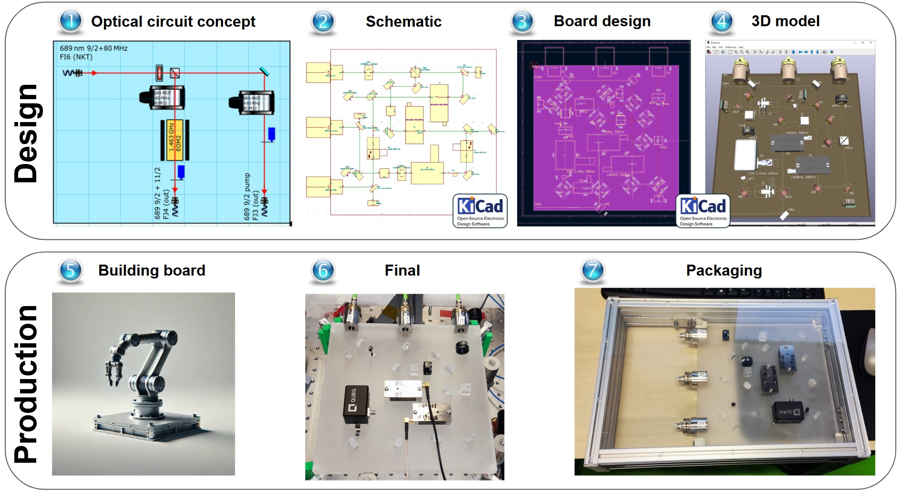
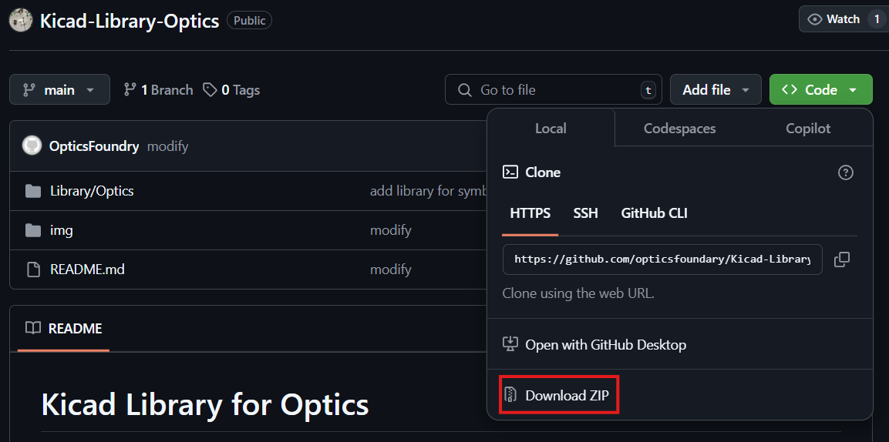
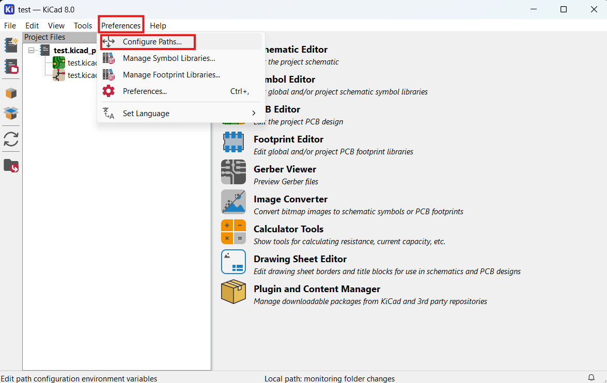
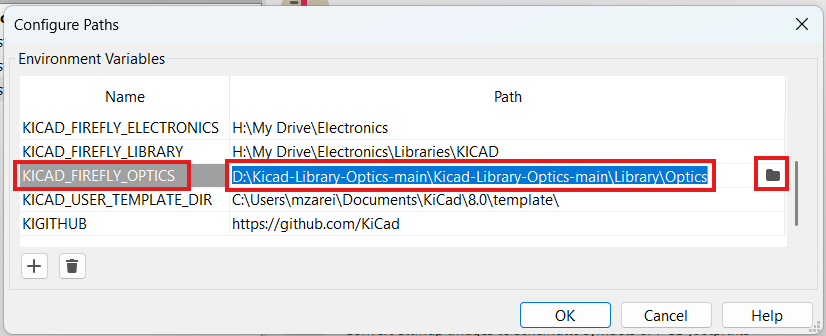
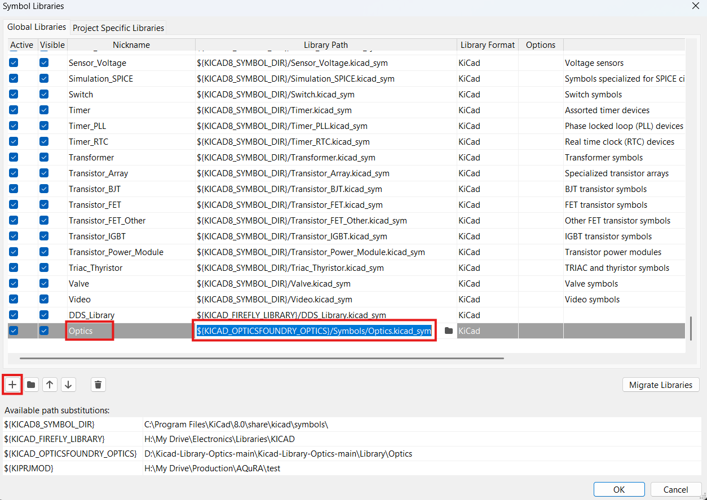
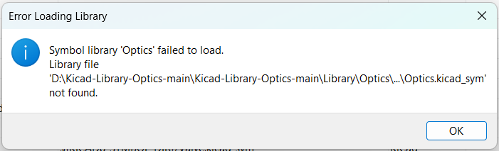
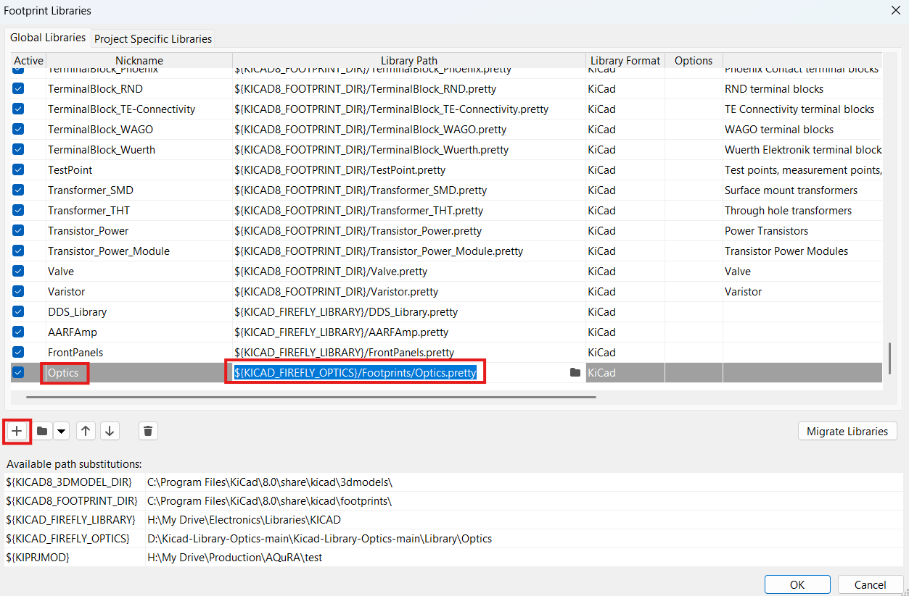
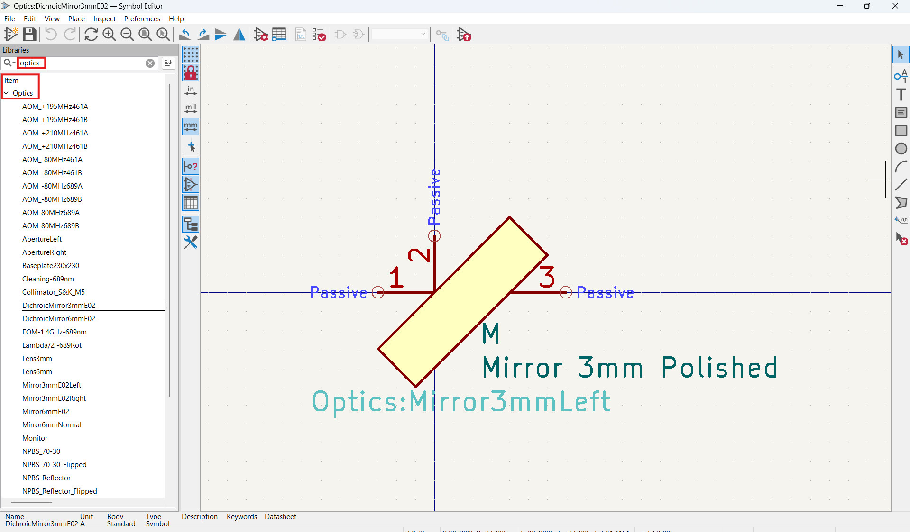
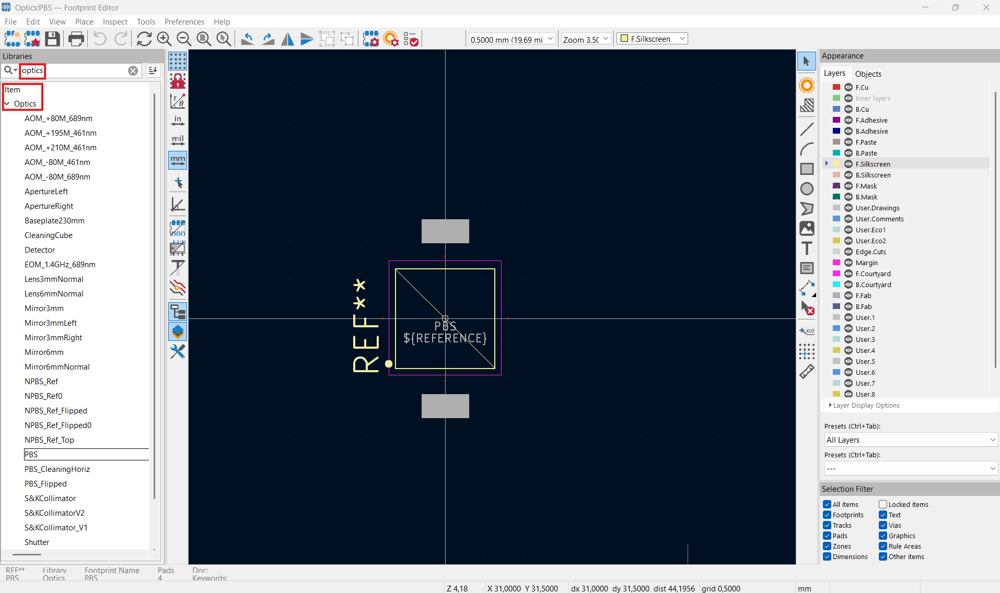

# KiCad Library for Optics

This repository includes a library for designing optical setups in KiCad.

Please visit our [website](https://www.opticsfoundry.com/) for more product and ordering.  
If you have any question or need help, write to us: opticsfoundary@gmail.com.

## Table of Contents
- [How to add library to KiCad](#how-to-add-library-to-kiCad)
- [Start a new design](#start-a-new-design)
  - [Schematic](#schematic)
  - [PCB](#pcb)
- [Free Projects](#free-projects)

---

## Introduction

[KiCad](https://www.kicad.org/) is an open source electronic design software. However, we have developed this library to be able to design optical setup.
The procedure of producing an optical setup with Robot developed by OpticsFoundry is shown below.

## How to add library to KiCad

1. Install KiCad from [here](https://www.kicad.org/),
2. Download or clone this repository to your computer as shown below,

3. Unzip the downloaded folder and move the folder to an appropriate path if you want,
4. Open the KiCad software, from `Preferences` tab, click on `Configure Paths...` as shown below,

5. Add a new path, name it `KIGITHUB` with path `https://github.com/KiCad`. As shown below,

6. Add another one and name it `KICAD_OPTICSFOUNDRY_OPTICS`, for the path click on folder icon and go to the path which the library has been downloaded then select `Optics` folder. As shown in following pictures,

7. At the end click on `OK` and close the window,
8. Now from `Preferences` tab, click on `Manage Symbol Libraries...`,
9. Add a new row and call it `Optics` with library path `${KICAD_OPTICSFOUNDRY_OPTICS}/Symbols/Optics.kicad_sym`. As shown below,

10. Then click on `OK` and close the window. If you encounter an error like below, probably the path is not defined correctly,

11. From `Preferences` tab, click on `Manage Footprint Libraries...`,
12. Add a new row and call it `Optics` with library path `${KICAD_OPTICSFOUNDRY_OPTICS}/Footprints/Optics.pretty`, at the end click on `OK` and close the window. As shown below,

13. To make sure the library has been added correctly, click on `Symbol Editor` and `Footprint Editor` in `Tools` tab. As shown below,

14. Search for `Optics` library in search bar, you should be able to see list of all the optical symbols and footprint. As shown in following pictures,

15. Done! Now you are ready to start a new optical design.

## Start a new design

### Schematic

### PCB

## Free Projects
1. [AQuRA](https://github.com/opticsfoundary/AQuRA-KiCad-Design-GitHub/)
